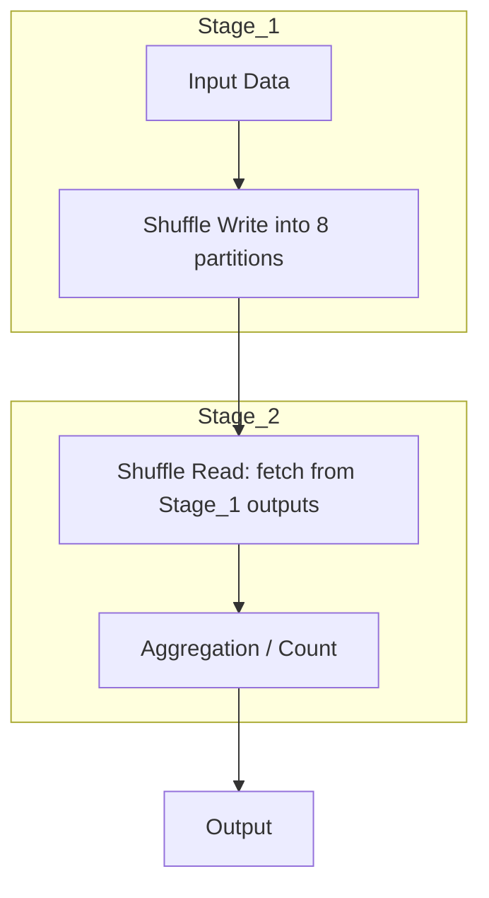

# Day 2 Diagram — Shuffle Read and Two-Stage Plan

Mermaid diagram:

Notes:
- This diagram illustrates the canonical two-stage pattern when you do df.repartition(8).groupBy().count(): Stage 1 writes shuffled data across 8 partitions; Stage 2 reads that shuffled data to perform the final aggregation.